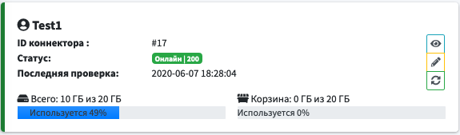
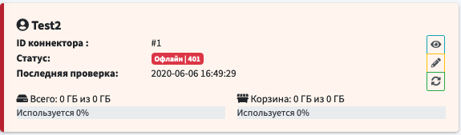

# Карточка коннектора

|Параметр|Описание|
|-|-|
|ID коннектора | Используется для внутренней идентификации коннектора|
|Статус | Текущий [статус коннектора](#статус-коннектора) и [код ответа](#код-ответа)|
|Последняя проверка| Дата и время последнего подключения к удаленному сервису|
|Всего| Показывается общий и занятый объем на удаленном сервисе|
|Корзина| Показывает общий и занятый непосредственно корзиной объем ну удаленном сервисе|

#### <u>Кнопки управления коннектором</u>

*  - просмотр карточки коннектора
*  - редактирование карточки коннектора
*  - обновление текущего статуса коннектора

### Статус коннектора
-  - коннектор онлайн.
-  - коннектор офлайн. Для диагностики проблемы необходимо посмотреть [код ответа](#код-ответа)..
    
    ##### Статус обновляется сразу при добавлении нового коннектора и после проверяется каждую минуту.

### Код ответа
-  - все хорошо
-  - UnauthorizedError
    
    Проверить правильность введенного токена
-  - Неизвестная ошибка.

### Удаление коннектора
При удалении коннектора удаляются и все логи для данного коннектора.
Если коннектор не может быть удален по какой-либо причине, то при попытке удаления будет получено сообщение об ошибке. Подробная информация об ошибке будет занесена в системный журнал.

### Очистка корзины
200 все хорошо
<b>202 - Successful (Успешный) / Accepted (Принято)</b>

Если операция очистки была запущена, но еще не завершилась, Яндекс.Диск отвечает кодом 202 Accepted

<b>204 - Successful (Успешный) / No Content (Нет содержимого)</b>

Если к данному моменту запрос удалось обработать без ошибок, API отвечает кодом 204 No Content

https://yandex.ru/dev/disk/api/reference/trash-delete-docpage/
