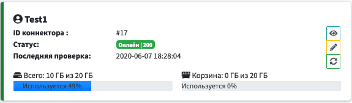
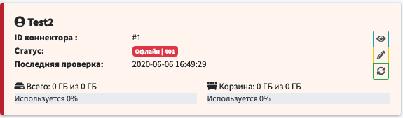

# Карточка коннектора

|Параметр|Описание|
|-|-|
|ID коннектора | Используется для внутренней идентификации коннектора|
|Статус | Текущий [статус коннектора](#статус-коннектора) и [код ответа](#код-ответа)|
|Последняя проверка| Дата и время последнего подключения к удаленному сервису|
|Всего| Показывается общий и занятый объем на удаленном сервисе|
|Корзина| Показывает общий и занятый непосредственно корзиной объем ну удаленном сервисе|

#### <u>Кнопки управления коннектором</u>

*  - просмотр карточки коннектора
*  - редактирование карточки коннектора
*  - обновление текущего статуса коннектора

### Статус коннектора
-  - коннектор онлайн.
-  - коннектор офлайн. Для диагностики проблемы необходимо посмотреть [код ответа](#код-ответа)..
    
    ##### Статус обновляется сразу при добавлении нового коннектора и после проверяется каждую минуту.

### Код ответа
-  - коннектор онлайн, сервис доступен.
-  - коннектор офлайн. Статус UnauthorizedError. Необходимо проверить правильность введенного токена
-  - Неизвестная ошибка на сервисе. Необходимо попробовать обновить статус позднее.

### Очистка корзины
* <b>202</b> - Successful (Успешный) / Accepted (Принято)
    
    Если операция очистки была запущена, но еще не завершилась, Яндекс.Диск отвечает кодом 202 Accepted

* <b>204</b> - Successful (Успешный) / No Content (Нет содержимого)

    Если к данному моменту запрос удалось обработать без ошибок, API отвечает кодом 204 No Content

Статусы записываются в системный журнал, при условии системный журнал был ранее включен.
* См. - [Включение системного журнала](../../../Settings/System/README.md)
* См. - [Просмотр системного журнала](../../../Settings/SystemLog/README.md)

##### Дополнительная информация - https://yandex.ru/dev/disk/api/reference/trash-delete-docpage/
